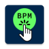

#  BPMTapper

A simple button tapper that displays the BPM of how fast you tap. Inspired by a similar app on the Play Store ([Tap Tempo Button](https://play.google.com/store/apps/details?id=com.diegoguevara.taptempo&hl=en_US)), I reproduced it as the first android app I've completed and as an introduction to the Jetpack Compose framework.

## Additions to Inspiration

1. An additional message is presented to inform you that you've begun tapping.
2. Reports BPM to 1 decimal place.
3. Provides a light and auto (system) theme, defaulting to dark.
4. Provides 12 theme colors, defaulting to green.
5. Font is available in proportional (if that's your device's default) and monospace (Source Code Pro) spacing, defaulting to monospace.
6. A landscape orientation with left/right handedness, defaulting to left hand

## A note about tapping

The app remembers the time between (at most) your last 10 taps. Your more recent taps are more influencial to the displayed BPM. Depending on how much your new tapping speed differs from the previous (e.g. 180 -> 60 or 20 -> 120) it may take up to 3–5 taps to get an accurate reading. If you're trying to go to a very slow rate (e.g. < 30), it's better to just reset to clear this tap history.

## Screenshots

|Portrait (dark mode)|Landscape (light mode) Displaying color options|
|---|---|
|||
