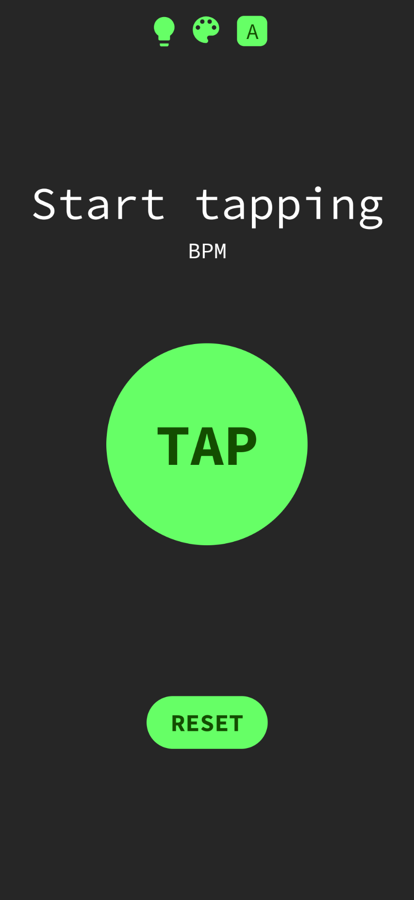
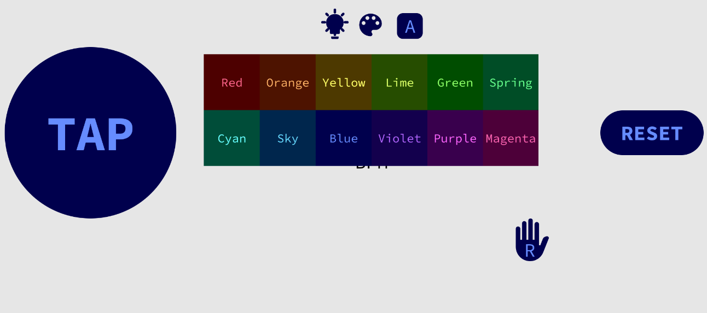

#  BPM Tapper

A simple button tapper that displays the BPM of how fast you tap.
This has the accuracy of your ability to tap the screen.
If you need better accuracy, you will need to find a specialized tool.

## Find the BPM of

1. A repeating sound.
2. The overall beat to a song.
3. A repeating visual.
4. A pulse.
5. Any other repeating thing where you can freely tap the screen.

## Features

1. A message indicating you haven't begun tapping.
2. An additional message to inform you that you've begun tapping.
3. Reports your BPM to 1 decimal place.
4. Provides a light, dark, and auto (system) theme, defaulting to dark.
5. Provides 12 theme colors, defaulting to green.
6. Font is available in proportional (if that's your device's default) and monospace (Source Code Pro) spacing, defaulting to monospace.
7. A landscape orientation with left/right handedness, defaulting to left hand

## A note about tapping

The app remembers the time between (at most) your last 10 taps.
Your more recent taps are more influential to the displayed BPM.
Depending on how much your new tapping speed differs from the previous (e.g. 180 -> 60 or 20 -> 120) it may take up to 3–5 taps to get an accurate reading.
If you're trying to go to a very slow rate (e.g. < 30), it's better to just reset to clear this tap history.

## Screenshots

| Portrait (dark mode)                          | Landscape (light mode) Displaying color options |
|-----------------------------------------------|----------------------------------------------------|
|  |  |
